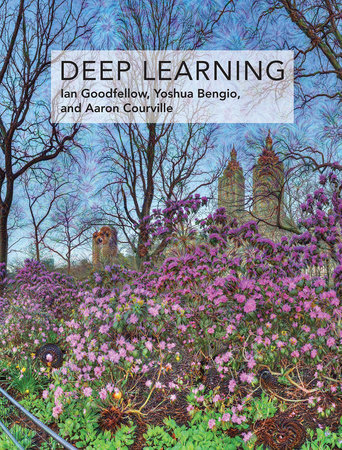

# Neural Blueprints

Implementation of the concepts and techniques described in the textbook *__Deep Learning__* by __Ian Goodfellow, Yoshua Bengio, and Aaron Courville__. Purely for educational purposes and for self-teaching.

Mainly written in Python.




https://www.deeplearningbook.org/


## Example block of code

```
let message = 'Hello world';
alert(message);
```
